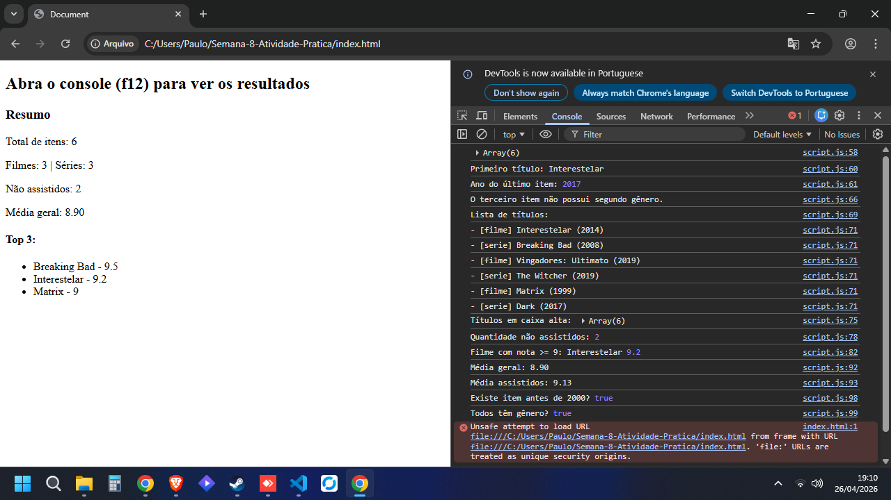

# Semana-8-Atividade-Pratica

Nesta atividade, você fazer exercícios de programação para 
vai praticar a manipulação de objetos e arrays em JavaScript, 
passando pela definição de dados em notação JSON (JavaScript Object Notation), 
acessando propriedades e itens, e usando iterators para processar os dados e 
gerar resultados.

## Aluno

Nome: Paulo Cirelli Fideles de Melo
Matrícula: 923845

## Descrição da Atividade
Projeto criado para desenvolver um catalogo simples
de filmes e series usando JavaScript com foco na
manipulação de objetos e arrays em formato JSON 

## Print da Tela

